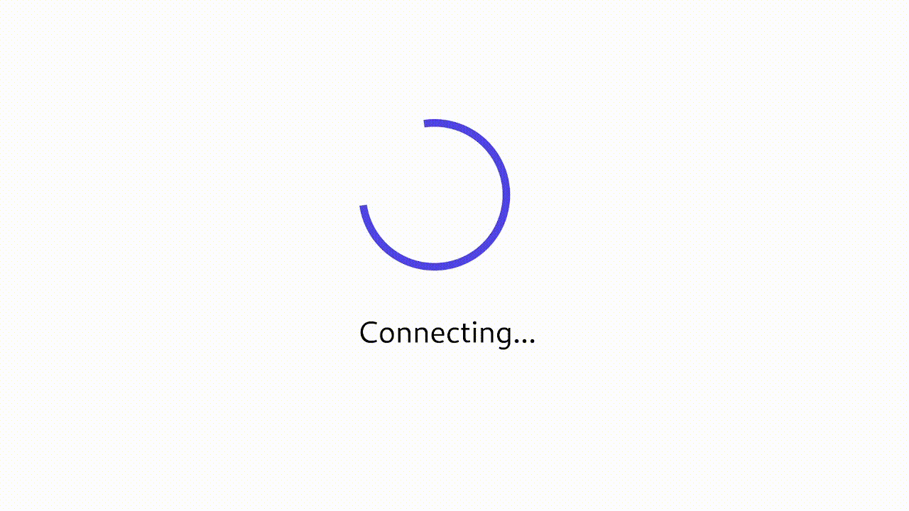

# Svelte Tailwind Widgets

This repository contains reusable [Svelte](https://svelte.dev/) components that are styled using the utility-first CSS framework [tailwind](https://tailwindcss.com/). In order to utilize these components, you have to use [Snel](https://github.com/crewdevio/Snel) which brings the Deno import system to Svelte.

# Component Listing

## Spinner

The Spinner component can be used to implement a nice loading animation



### Usage Example:

You can also add a descriptive text to the spinner.

```html
<script lang="ts">
  import Spinner from 'https://deno.land/x/svelte_tailwind_widgets/Spinner.svelte';
  $: isLoading = true
</script>

{#if isLoading}
  <div class="flex flex-col items-center justify-center">
    <Spinner>
      <p class="p-5">Loading...</p>
    </Spinner>
  </div>
{/if}
<div class:hidden={isLoading}>
  <p>This paragraph is only visible if the Spinner is not loading</p>
</div>
```
